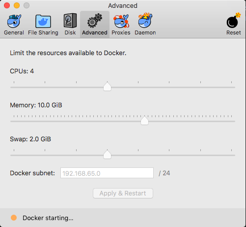

# Automation

A docker compose project for running the dp-api-tests

## Requirements

- Docker
- Docker compose

## Running the tests

Specify the branches you want to run in the .env file

Run `docker-compose down` to remove any previously running containers

## Building the containers

Before you run any tests, it is recommended that you run:

`docker-compose build` to build the necessary docker images. Please note this will likely take several minutes.

## Changing branches

To change the branch that you wish to run a service or the api tests on, simply modify the branch name in the .env file. For example setting:

`IMPORT_API_BRANCH=feature/my-thing`

will allow the import api to be ran on the `feature/my-thing` branch.

### End to end tests

Before running end to end tests, you will need to increase the resources available to docker. You can do this by clicking on the docker icon > advanced, and setting the resources to a similar level of that below:

Once you have changed the resources, click Apply & Restart. (Remember to revert back to the original settings once you have finished) Once docker has restarted, run the following to start the end to end tests:

`./end-to-end-test.sh`

### Dataset api

`./dataset-api-web-test.sh`
`./dataset-api-publishing-test.sh`

### Download Service

`./download-service-web-test.sh`
`./download-service-publishing-test.sh`

### Filter api

`./filter-api-web-test.sh`
`./filter-api-publishing-test.sh`

### Hierarchy api

`./hierarchy-api-test.sh`

### Import api

`./import-api-test.sh`

### Search api

`./search-api.tesh.sh`